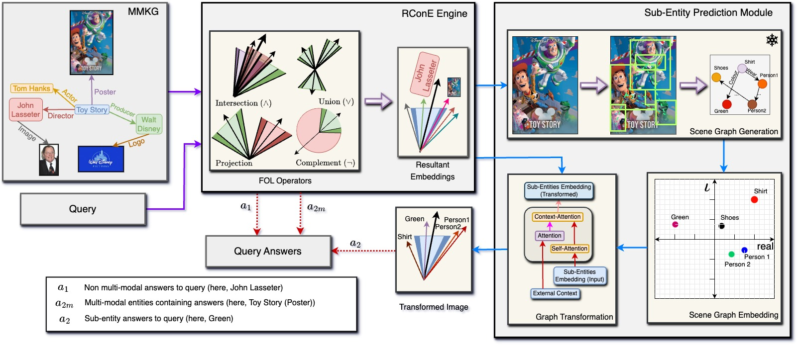

# RConE: Rough Cone Embedding for Multi-Hop Logical Query Answering on Multi-Modal Knowledge Graphs

The repository consists of code for our RConE paper.



Below is the description of each model. Readme is provided in folders to run the code.
## Folders

### fcsgg 
The folder consists of Scene Graph Generation module for our model.

### baselines
Contains preprocessing file for datasets to be compatible for both the baselines (ConE and BetaE).

### dataset
Will contain dataset files (see installation step - Prepare dataset).

### model 
RConE model

## Installation

### Prepare dataset
+ Download the dataset folder from link - https://drive.google.com/file/d/1UknhjOn86U0SsPwfmHZHt2XwOb-GG66H/view?usp=sharing
+ unzip the folder and extract as the ```dataset``` folder (replace it with current empty dataset folder).

### Prepare RConE module
Move to ```model``` folder, and follow the instructions in its README.md file to prepare our model.

### Prepare baselines
Move to baselines folders

Download the models from

+ ConE - https://github.com/MIRALab-USTC/QE-ConE/tree/main
+ BetaE - https://github.com/snap-stanford/KGReasoning
+ run preprocess.py for each dataset based on the updated location in the file (preprocess.py)


## Code Execution
After following all the installation steps, follow following commands for query generation and to run the model.

### Query Generation
#### Scene Graph Generation
Generate scene graphs for ```fb-15k``` dataset by following steps in the ```fcsgg``` folder and copy the results in the ```model/results``` folder with architecture config ```32``` or ```48```, as currently present
#### ComplEx
Move to ```model/complex``` folder. 
Uncomment the desired dataset command in the following script files and then run.

    sh script_preprocess.sh
    sh script_main.sh
    sh script_post.sh 
#### Create Queries
Move to ```model``` folder. Run command 

    sh query_scriptfb.sh
for ```fb15k dataset``` (similar scripts are there for other datasets).

## RConE
### Scene Graph Generation
Generate scene graphs for ```fb-15k``` dataset by following steps in the ```fcsgg``` folder and copy the results in the ```model/results``` folder with architecture config ```32``` or ```48```, as currently present
 
### Preprocess
Move to ```model``` folder. Run command 

    python process.py
    python transform_preprocess.py
    cd complex
    sh script_inrun.sh

#### Training
Move to ```model``` folder. Uncomment the dataset command you want to train the model onin the script file and than execute.

    scripts.sh
The trained model will be in ```log``` folder with desired dataset name

#### Testing
After model is trained (in the ```model``` folder).
uncomment the dataset command you want to train the model on in the script file and than execute.

    scripts_test.sh
The results will be in ```log``` folder with desired dataset name under file ```test.log```

## Acknowledgement
+ https://github.com/MIRALab-USTC/QE-ConE/tree/main
+ https://github.com/snap-stanford/KGReasoning
+ https://github.com/liuhengyue/fcsgg
+ https://github.com/ttrouill/complex
